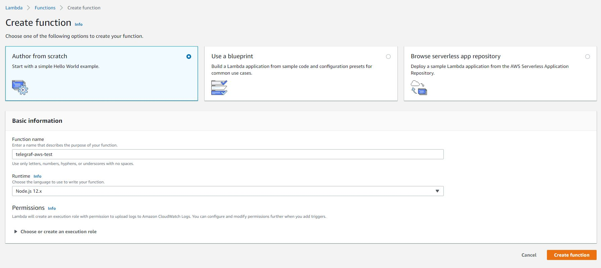
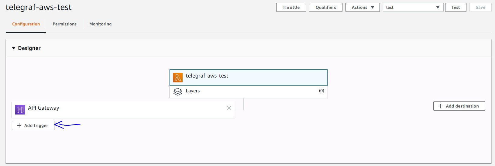
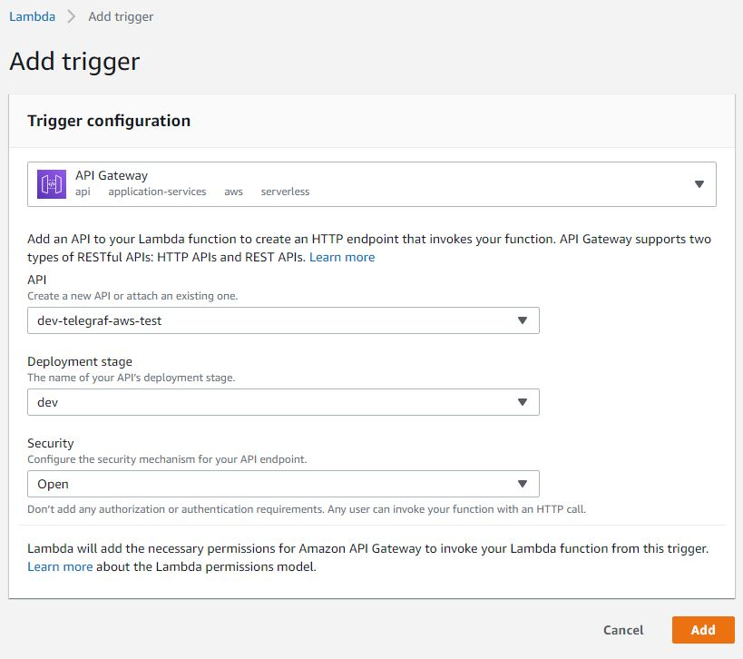
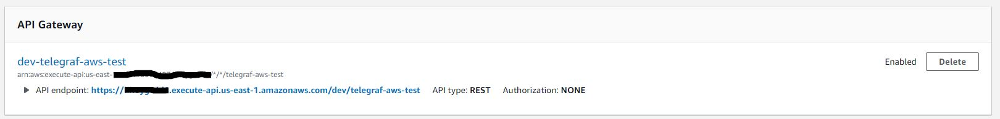
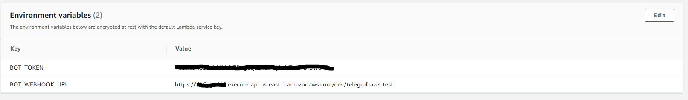
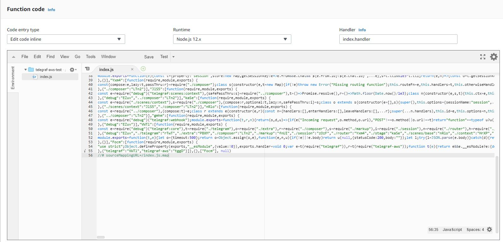

### Telegraf AWS Example

This repository contains simple bot that can be deployed to aws lambda.

First install dependencies and build:

```
yarn
yarn build
```

Now you should have `index.js` in directory dist. This is code that'll deploy.
Next step is to get token for your bot. Open telegram, go to @BotFather and create your bot if you didn't already. You should receive token that looks like `12345678910:AAAAA-7AAA6AAAAAA1P-AAAAA_AAAAAAAAA`

After you obtain token, you can create your lambda function. Go to AWS Labmda and follow Create function dialog https://console.aws.amazon.com/lambda/home?region=us-east-1#/create/function


For your function to be accessable, you need to create trigger. Open your function and click Add trigger



Add environment variables `BOT_TOKEN` and `BOT_WEBHOOK_URL`, so your bot can use telegram api. Bot token is token you got from BotFather and BOT_WEBHOOK_URL is url of your trigger API endpoint



Last step is to upload your code. Copy content of dist/index.js and paste it into AWS code editor


Click test and all done! You should be able to send sticker to your bot and receive response!
